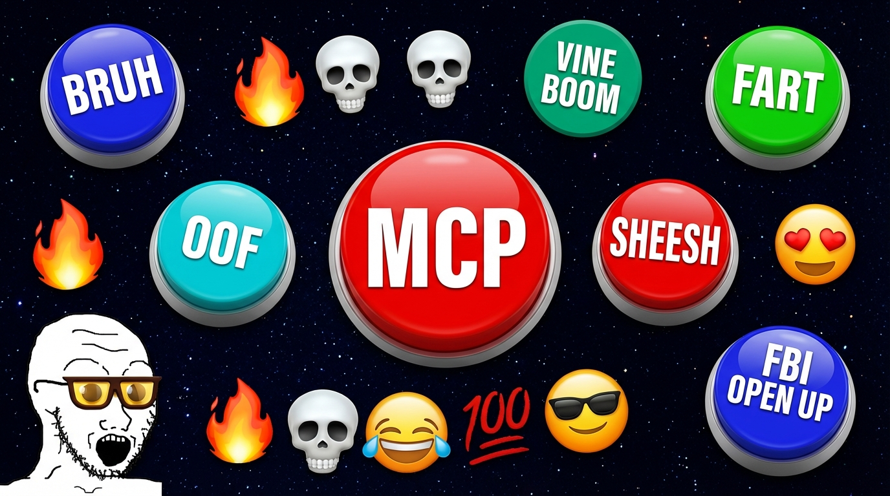
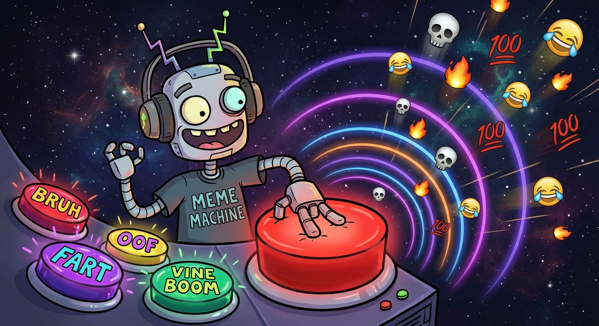

<p align="center">
  
</p>

<h1 align="center">🔴 myinstants-mcp</h1>

<p align="center">
  <strong>give your AI agent a soundboard. no cap.</strong><br/>
  <sub>millions of sound buttons. streamed directly. zero downloads. just vibes.</sub>
</p>

---



## fr fr what is this

an [MCP](https://modelcontextprotocol.io) server that connects AI agents to [myinstants.com](https://www.myinstants.com) — the internet's largest soundboard. millions of meme sounds, vine booms, fart noises, anime clips, gaming sfx, whatever you need bestie.

your AI agent can now:
- 🔍 **search** any sound on myinstants
- 🔴 **smash that button** and play it through your speakers
- 📂 **browse categories** — memes, games, movies, reactions, tiktok trends
- 📈 **check what's trending** — stay current fr fr

this is not a notification beep. this is the entire internet soundboard. your agent has rizz now.

## the setup is bussin

```bash
npx myinstants-mcp
```

that's it. that's the setup. no cap.

### VS Code (Copilot Chat)

`.vscode/mcp.json`:
```json
{
  "servers": {
    "myinstants": {
      "command": "npx",
      "args": ["-y", "myinstants-mcp"]
    }
  }
}
```

### Claude Desktop

`~/Library/Application Support/Claude/claude_desktop_config.json`:
```json
{
  "mcpServers": {
    "myinstants": {
      "command": "npx",
      "args": ["-y", "myinstants-mcp"]
    }
  }
}
```

### Cursor

`.cursor/mcp.json`:
```json
{
  "mcpServers": {
    "myinstants": {
      "command": "npx",
      "args": ["-y", "myinstants-mcp"]
    }
  }
}
```

---


## what can it do tho 🤔

### 🔧 Tools

| Tool | What it does | It's giving |
|------|-------------|---------|
| `search_sounds` | search myinstants for sounds | `"bruh"` → 20 results with slugs |
| `browse_category` | browse by category | `"memes"` `"games"` `"reactions"` |
| `play_sound` | play a sound (by slug, url, or quick search) | `{ query: "sad trombone" }` plays instantly |

### 📚 Resources

| Resource | The vibe |
|----------|-------------|
| `myinstants://trending` | what's bussin rn in the US 🔥 |
| `myinstants://categories` | all 14 categories no cap |
| `myinstants://best` | hall of fame. the GOATs. the legends. 🐐 |

### Categories

`anime & manga` · `games` · `memes` · `movies` · `music` · `politics` · `pranks` · `reactions` · `sound effects` · `sports` · `television` · `tiktok trends` · `viral` · `whatsapp audios`

## how it works (for the sigma devs)

```
agent calls play_sound({ query: "vine boom" })
  → searches myinstants.com
  → finds the MP3 URL
  → streams it through ffplay/mpv
  → sound plays through your speakers
  → tool returns immediately (non-blocking)
  → agent keeps cooking while you hear the boom
```

sounds queue up automatically. no overlap. your agent can fire multiple sounds and they play one after another. sheesh.

## env vars

| Variable | Default | The tea ☕ |
|----------|---------|------|
| `MYINSTANTS_VOLUME` | `0.5` | how loud (0-1). crank it bestie. |

## requirements

just need one audio player installed. it's not that deep:

```bash
brew install ffmpeg   # macOS (slay)
sudo apt install ffmpeg  # linux
# mpv also works no cap
```

## why tho 💀

because your AI agent should be able to hit you with a vine boom when the code compiles. because sad trombone when tests fail is objectively correct. because the bruh button exists and your agent deserves to press it. this is not delulu — this is the future.

every other MCP sound server plays one notification beep. **one beep.** that's giving NPC energy. we have millions of sounds. the entire internet soundboard. main character behavior only.

## it's giving... open source 💅

made by [@tag-assistant](https://github.com/tag-assistant) 🏷️

powered by [myinstants.com](https://www.myinstants.com) · built with [MCP](https://modelcontextprotocol.io)

no cap this might be the most unhinged MCP server ever and we're lowkey proud of it 💀🔥
