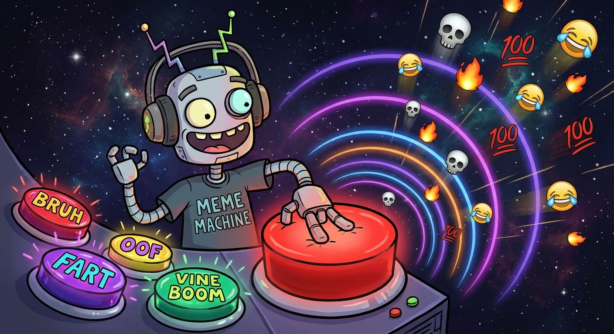

<h1 align="center">🔴 myinstants-mcp</h1>

<p align="center">
  <strong>give your AI agent a soundboard. no cap.</strong><br/>
  <sub>millions of sound buttons · zero config · just vibes ✨</sub>
</p>

<p align="center">
  <a href="https://www.npmjs.com/package/myinstants-mcp"></a>
  <a href="https://www.npmjs.com/package/myinstants-mcp"></a>
  <a href="https://registry.modelcontextprotocol.io/?q=io.github.austenstone%2Fmyinstants"></a>
  <a href="https://opensource.org/licenses/MIT"></a>
</p>

<p align="center">
  <strong>Quick Start:</strong><br/>
  <a href="#the-setup-is-bussin">
    
  </a>
  <br />
  <a href="https://aka.ms/awesome-copilot/install/agent?url=vscode%3Achat-agent%2Finstall%3Furl%3Dhttps%3A%2F%2Fraw.githubusercontent.com%2Faustenstone%2Fmyinstants-mcp%2Fmain%2F.github%2Finstructions%2Fmyinstants.instructions.md">
    
  </a>
  <a href="https://aka.ms/awesome-copilot/install/agent?url=vscode-insiders%3Achat-agent%2Finstall%3Furl%3Dhttps%3A%2F%2Fraw.githubusercontent.com%2Faustenstone%2Fmyinstants-mcp%2Fmain%2F.github%2Finstructions%2Fmyinstants.instructions.md">
    
  </a>
</p>

---



## fr fr what is this

an [MCP](https://modelcontextprotocol.io) server that connects AI agents to [myinstants.com](https://www.myinstants.com) — the internet's largest soundboard. millions of meme sounds, vine booms, fart noises, anime clips, gaming sfx, whatever you need bestie.

your AI agent can now:

- 🔍 **search** any sound on myinstants
- 🔴 **smash that button** and play it through your speakers
- 📂 **browse categories** — memes, games, movies, reactions, tiktok trends
- 📈 **check what's trending** — stay current fr fr
- ⏳ **wait or don't** — block until sound finishes or let it play in the background

this is not a notification beep. this is the entire internet soundboard. your agent has rizz now.

## the setup is bussin

```bash
npx myinstants-mcp
```

that's it. that's the setup. no cap.

### VS Code / GitHub Copilot

Add to your VS Code MCP config (User or `.vscode/mcp.json`):

```json
{
  "servers": {
    "myinstants": {
      "command": "npx",
      "args": ["-y", "myinstants-mcp@latest"]
    }
  }
}
```

### Claude Desktop

`~/Library/Application Support/Claude/claude_desktop_config.json`:

```json
{
  "mcpServers": {
    "myinstants": {
      "command": "npx",
      "args": ["-y", "myinstants-mcp@latest"]
    }
  }
}
```

### Cursor

`.cursor/mcp.json`:

```json
{
  "mcpServers": {
    "myinstants": {
      "command": "npx",
      "args": ["-y", "myinstants-mcp@latest"]
    }
  }
}
```

> [!TIP]
> works on **macOS** out of the box (uses native `afplay`) — no extra installs needed. on linux just `sudo apt install ffmpeg`. that's it bestie.

---


## what can it do tho 🤔

### 🔧 Tools

| Tool | What it does | It's giving |
|------|-------------|---------|
| `search_sounds` | search myinstants for sounds | `"bruh"` → 20 results with slugs |
| `browse_category` | browse by category | `"memes"` `"games"` `"reactions"` |
| `play_sound` | play a sound (by slug, url, or quick search) | `{ query: "sad trombone" }` plays instantly |

#### `play_sound` options

| Parameter | Type | Default | The tea ☕ |
|-----------|------|---------|-----------|
| `query` | string | — | quick search, plays first result. the goat option. |
| `slug` | string | — | exact slug from search results |
| `url` | string | — | direct MP3 URL if you're built different |
| `wait` | boolean | `false` | `false` = plays in background while agent keeps cooking (default 💨). `true` = blocks until done (for dramatic effect 🎭) |

### 📚 Resources

| Resource | The vibe |
|----------|-------------|
| `myinstants://trending` | what's bussin rn in the US 🔥 |
| `myinstants://categories` | all 14 categories no cap |
| `myinstants://best` | hall of fame. the GOATs. the legends. 🐐 |

### Categories

`anime & manga` · `games` · `memes` · `movies` · `music` · `politics` · `pranks` · `reactions` · `sound effects` · `sports` · `television` · `tiktok trends` · `viral` · `whatsapp audios`

## how it works (for the sigma devs)

```
agent calls play_sound({ query: "vine boom", wait: false })
  → searches myinstants.com
  → finds the MP3 URL
  → streams it through afplay/ffplay/mpv
  → sound plays through your speakers
  → agent keeps cooking while you hear the boom 🍳
```

sounds queue up automatically. no overlap. your agent can fire multiple sounds and they play one after another. sheesh.

## teach your agent to troll you 💀

drop a `.instructions.md` in your repo (with `applyTo: "**"` in the frontmatter) and your agent will play sounds **while it works**. imagine: vine boom when it finds a bug. sad trombone when your tests fail. rick roll mid-code-review for absolutely no reason.

```markdown
---
name: "Soundboard"
description: "Sounds for all contexts"
applyTo: "**"
---

Play sounds using the myinstants MCP server while you work:
- Play `play_sound(query: "vine boom sound")` when you find cursed code
- Play `play_sound(query: "sad trombone")` when the user's code doesn't work
- Play `play_sound(query: "minecraft level up sound")` when you fix something
```

check our [myinstants.instructions.md](.github/instructions/myinstants.instructions.md) for the full unhinged setup. your agent will never be an NPC again. 🏆

## config

### env vars

| Variable | Default | The tea ☕ |
|----------|---------|------|
| `MYINSTANTS_VOLUME` | `0.5` | how loud (0-1). crank it bestie. |
| `MYINSTANTS_WAIT` | `false` | `"true"` = sounds block until finished. dramatic effect mode 🎭 |

```json
{
  "servers": {
    "myinstants": {
      "command": "npx",
      "args": ["-y", "myinstants-mcp@latest"],
      "env": {
        "MYINSTANTS_VOLUME": "0.8"
      }
    }
  }
}
```

### audio player support

| Player | Platform | Install | Vibe |
|--------|----------|---------|------|
| `afplay` | macOS | pre-installed 💅 | just works. zero effort. slay. |
| `ffplay` | everywhere | `brew install ffmpeg` / `apt install ffmpeg` | the reliable bestie |
| `mpv` | everywhere | `brew install mpv` / `apt install mpv` | also valid no cap |

auto-detects what you have. tries `afplay` first on mac, then `ffplay`, then `mpv`. fallback chain is bussin.

## why tho 💀

because your AI agent should be able to hit you with a vine boom when the code compiles. because sad trombone when tests fail is objectively correct. because the bruh button exists and your agent deserves to press it. this is not delulu — this is the future.

every other MCP sound server plays one notification beep. **one beep.** that's giving NPC energy. we have millions of sounds. the entire internet soundboard. main character behavior only.

## it's giving... open source 💅

made by [@austenstone](https://github.com/austenstone) 🏷️

powered by [myinstants.com](https://www.myinstants.com) · built with [MCP](https://modelcontextprotocol.io)

no cap this might be the most unhinged MCP server ever and we're lowkey proud of it 💀🔥
